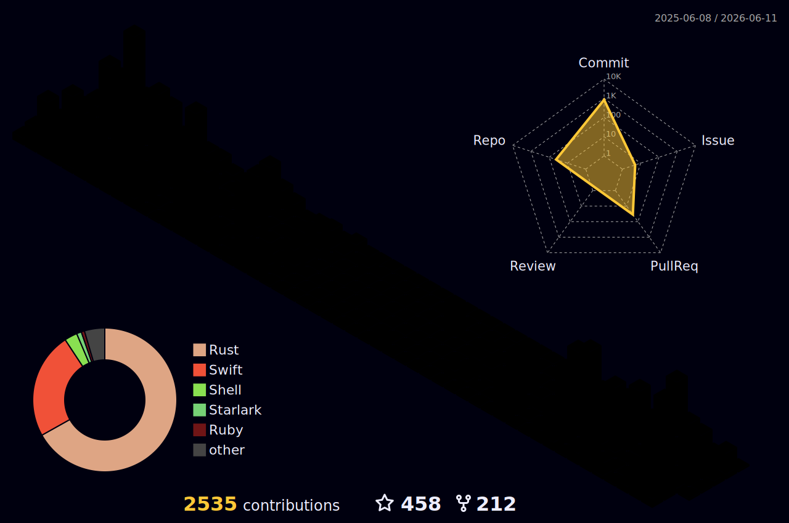

<!-- markdownlint-disable MD033 MD041 -->

<p align="center">
  <a href="https://github.com/codeitlikemiley">
    
  </a>
</p>

<div align="center">
  <p>
    <a href="https://visitorbadge.io/status?path=codeitlikemiley%2Fcodeitlikemiley">
      
    </a>
    <a href="https://github.com/sponsors/codeitlikemiley">
      
    </a>
  </p>
</div>

---

## ⚡ The Pillars of Focus

<table width="100%">
  <tr>
    <td width="33%" valign="top">
      <h3>🤖 Agentic AI</h3>
      <p>Building autonomous, local-first intelligent runtimes, terminals, and agentic workflows that replace heavy Python stacks with safe, ultra-fast Rust.</p>
    </td>
    <td width="33%" valign="top">
      <h3>🕸️ WASM & WASI</h3>
      <p>Compiling the future to WebAssembly. Specializing in WASI Preview 2, server-side SSR edge nodes, and secure cloud micro-services.</p>
    </td>
    <td width="33%" valign="top">
      <h3>⚡ Developer DX</h3>
      <p>Crafting high-speed terminal tools, IDE integrations, and automated setups to minimize friction and boost developer performance by 10X.</p>
    </td>
  </tr>
</table>

---

## 🚀 Featured Open Source Work

### 🤖 Agentic AI & Intelligent Tooling

*   **[Tool Mapping Protocol (TMP)](https://github.com/codeitlikemiley/tmp)** — *Creator & Author*
    *   Devised the Tool Mapping Protocol (TMP), a structured context-grounding protocol that defines JSON schemas for command-line utilities. Integrated natively inside **Waz** to deliver:
        *   **Elimination of LLM Hallucinations**: Replaces verbose, error-prone markdown tool descriptions with strict, model-native tool schemas. AI agents are presented with deterministic options and queryable dynamic data sources (e.g. Git status, workspace packages, script configs) to fetch real-time workspace state rather than guessing inputs.
        *   **Reduced Token Usage & Tool Overhead**: Drastically reduces prompt token consumption and execution latency. By providing structured schemas and resolving context upfront, it avoids the need for the AI to make additional, costly tool calls to resolve dependencies or figure out how to invoke commands.
        *   **Supercharged Autocomplete**: Maps workspace configs (like `Cargo.toml` dependencies or `package.json` scripts) to dynamically suggest paths, flags, and resolver values inside the terminal's Form Panel.
        *   **Dynamic Agent Tooling**: Compiles local TMP definitions directly into structured, JSON-Schema tool definitions. AI agents invoke terminal commands via validated, sanitized key-value parameters which are securely translated to shell instructions on the local Rust runtime.
*   **[`waz`](https://github.com/codeitlikemiley/waz)** — *Local-First AI Terminal (Warp Fork)*
    *   An open, local-first terminal (forked from Warp) stripped of mandatory cloud accounts and paid memberships.
    *   **Native TMP Integration**: Natively integrates the **Tool Mapping Protocol (TMP)** to:
        *   Provide supercharged tab-autocomplete for paths, flags, and dynamic values (e.g. from `git status`) inside the terminal's Form Panel.
        *   Translate local command schemas directly into model-native tool definitions (`GenaiTool`), validating parameters against JSON-Schema specifications, sanitizing inputs against shell injection, and compiling them into safe shell instructions executed natively on the Rust runtime.
    *   **Agent & Provider Support**: Integrates local AI provider support via Bring Your Own Key/Provider (BYOK/BYOP) and enables secure, local execution of third-party CLI agents (such as Claude Code and DeepSeek-TUI) wired directly into Blocks.
*   **[`antigravity-sdk-rust`](https://github.com/codeitlikemiley/antigravity-sdk-rust)** — *Google Antigravity Rust SDK*
    *   Build type-safe, highly asynchronous multi-agent orchestration systems natively in Rust. Connect LLMs, manage memory states, and define tool calls with zero-overhead async runtimes.

### 🕸️ WebAssembly, WASI & Edge Cloud

*   **[`wasm-bindgen`](https://github.com/rustwasm/wasm-bindgen)** — *High-Level JS Interop*
    *   Contributor to the core Rust-to-WebAssembly binding pipeline, maintaining performance-critical libraries that facilitate high-level interop between Wasm modules and JS.
*   **[`leptos_wasi`](https://github.com/codeitlikemiley/leptos_wasi)** — *Leptos WASI Preview 2 Integration*
    *   Full integration of the Leptos web framework with WASI Preview 2. Run high-performance fullstack Rust applications on edge runtimes like wasmcloud and Fermyon Spin.
*   **[`leptos-spin`](https://github.com/codeitlikemiley/leptos-spin)** — *Full-Stack Spin Template*
    *   Template for running server-side rendered (SSR) Leptos applications natively inside Fermyon Spin webassembly modules.
*   **[`wasi-auth-middleware`](https://github.com/codeitlikemiley/wasi-auth-middleware)** — *WASM Auth Component*
    *   A portable, sandboxed WebAssembly component executing GitHub authentication and session authorization logic securely at the edge.
*   **[`tauri-leptos-ssr`](https://github.com/codeitlikemiley/tauri-leptos-ssr)** — *Tauri v2 + Leptos SSR + Tailwind v4*
    *   A modern template to build lightweight, cross-platform desktop applications utilizing server-side rendering benefits and cutting-edge styling systems.

### ⚡ High-Performance Rust & Developer DX

*   **[`cargo-runner`](https://github.com/codeitlikemiley/cargo-runner)** — *VSCode Cargo Crates Runner*
    *   A popular VSCode extension to execute cargo tasks and manage crates directly from the editor, streamlining your development pipeline.
    *   [](https://marketplace.visualstudio.com/items?itemName=masterustacean.cargo-runner) [](https://open-vsx.org/extension/masterustacean/cargo-runner)
*   **[`leptos-fmt`](https://github.com/codeitlikemiley/leptos-fmt)** — *VSCode Leptos Formatter*
    *   A specialized editor extension dedicated to formatting Rust Leptos view macros and markup code with speed and high precision.
    *   [](https://marketplace.visualstudio.com/items?itemName=masterustacean.leptos-fmt) [](https://open-vsx.org/extension/masterustacean/leptos-fmt)

---

## 🏢 Startups & Commercial Products

*   **`Buwiz`** (Goldcoders Corp.) — *Creator & Lead Engineer*
    *   An offline-first, high-security fintech ecosystem designed for business accounting and tax automation:
        *   **`Buwiz Books`** — Multi-tenant ledger systems and business accounting engines.
        *   **`Buwiz Forms`** — Smart tax forms filing and BIR e-filing automation tools.
        *   **`Buwiz AI Agent`** — Autonomous AI bookkeeping agents automating transaction categorization and accounts mapping.
*   **`Bad Character Scanner`** (Bad Character Scanner Codebase Inc.) — *Co-Founder & Lead Engineer*
    *   Co-founded the Bad Character Scanner codebase, a deep binary-level threat assessment scanner identifying invisible characters, malicious Unicode homoglyphs, and Trojan Source compiler exploits.
*   **`Watch Crunch`** (Watchcrunch LLC) — *Mobile Engineer*
    *   Architected and built the mobile applications for Watch Crunch, the premier social cataloging and community platform for global watch enthusiasts.
*   **`Stylar App`** (Sphene Studio Inc.) — *Mobile & AI Engineer*
    *   Developed the mobile application and virtual try-on workflow interfaces leveraging advanced diffusion models for AI-driven fashion styling and outfit simulation.

---

## 🛠️ Tech Stack & Ecosystem

```text
       Core Languages  │ Rust, WebAssembly (WASM/WASI), TypeScript, Swift, Go, Dart
     Frontend Frameworks  │ Leptos, Dioxus, React, SolidJS, Svelte, Tailwind CSS (v4)
      Backend & Runtimes  │ Axum, Tonic (gRPC), Actix, Fermyon Spin, Wasmcloud, Bun, Node
 Infrastructure & Edge  │ Docker, Kubernetes, Terraform, Cloudflare R2, AWS, GCP, Vercel
     Workflow & Tooling  │ Neovim, Zed, Cargo, Bazel, git, Xcode, Android Studio
```

<p align="center">
  <a href="https://skillicons.dev">
    
  </a>
</p>

---

## 💻 Custom Configurations & Dotfiles

I thrive on maintaining an identical, optimized developer environment across all major operating systems. Here are the configs that power my 10X workflow:

<details>
  <summary><b>🐧 Operating System Dotfiles (Expand/Collapse)</b></summary>
  <ul>
    <li><a href="https://github.com/codeitlikemiley/huawei-mb13-dotfiles-archlinux">Arch Linux Dotfiles</a> — Optimized for mobile setups.</li>
    <li><a href="https://github.com/codeitlikemiley/artix-dotfiles">Artix Linux Dotfiles</a> — Runit-based system configurations.</li>
    <li><a href="https://github.com/goldcoders/mac-m1-dotfiles">macOS Dotfiles</a> + <a href="https://github.com/x10-config/10x-dev-macosx-workflow">10X Mac Developer Workflow</a>.</li>
    <li><a href="https://github.com/goldcoders/windows-10-dotfiles">Windows Dotfiles</a> — High-productivity settings.</li>
  </ul>
</details>

<details>
  <summary><b>⚙️ IDE & Editor Settings (Expand/Collapse)</b></summary>
  <ul>
    <li><a href="https://github.com/codeitlikemiley/nvim">Neovide Rust Edition</a> — GPU-accelerated Neovim environment.</li>
    <li><a href="https://github.com/codeitlikemiley/zed-config">Zed Configuration</a> — Optimizations for the ultra-fast Rust editor.</li>
    <li><a href="https://github.com/codeitlikemiley/vscode-neovim">VSCode with Neovim</a> — Hybrid productivity layout.</li>
    <li><a href="https://github.com/codeitlikemiley/rust-rover-settings">Rust Rover Settings</a> — JetBrains Rust tuning.</li>
    <li><a href="https://github.com/codeitlikemiley/kotlin-settings">IntelliJ Settings for Kotlin</a>.</li>
    <li><a href="https://github.com/codeitlikemiley/xcode-settings">Xcode Settings</a> — Customized for Swift/Mac builds.</li>
  </ul>
</details>

---

## 📊 Analytics & Contribution Activity

<table border="0" width="100%">
  <tr>
    <td width="50%" align="center">
      
    </td>
    <td width="50%" align="center">
      
    </td>
  </tr>
  <tr>
    <td colspan="2" align="center">
      <br />
      
    </td>
  </tr>
</table>

### 🗺️ 3D Isometric Contribution Graph

<p align="center">
  
</p>

### 🐍 Contribution Activity (Snake Game)

<p align="center">
  
</p>

### ⚡ Recent Open-Source Activity

<!--START_SECTION:activity-->
1. 🎉 Merged PR [#92](https://github.com/leptos-rs/awesome-leptos/pull/92) in [leptos-rs/awesome-leptos](https://github.com/leptos-rs/awesome-leptos)
2. 💪 Opened PR [#92](https://github.com/leptos-rs/awesome-leptos/pull/92) in [leptos-rs/awesome-leptos](https://github.com/leptos-rs/awesome-leptos)
3. 🔒 Closed issue [#7](https://github.com/codeitlikemiley/antigravity-sdk-rust/issues/7) in [codeitlikemiley/antigravity-sdk-rust](https://github.com/codeitlikemiley/antigravity-sdk-rust)
4. 🔓 Reopened issue [#7](https://github.com/codeitlikemiley/antigravity-sdk-rust/issues/7) in [codeitlikemiley/antigravity-sdk-rust](https://github.com/codeitlikemiley/antigravity-sdk-rust)
5. 🔒 Closed issue [#7](https://github.com/codeitlikemiley/antigravity-sdk-rust/issues/7) in [codeitlikemiley/antigravity-sdk-rust](https://github.com/codeitlikemiley/antigravity-sdk-rust)
<!--END_SECTION:activity-->

---

## 🌐 Connect & Collaborate

Let's discuss Rust, WASI components, or AI Agent ecosystems.

<p align="center">
  <a href="https://linkedin.com/in/codeitlikemiley">
    
  </a>
  <a href="https://x.com/buggyDcode">
    
  </a>
  <a href="https://www.facebook.com/x0x0x0x0x0x0x0x0x0x0x0x0x0x0x0x0x0x0x0x0x0x0x0x/">
    
  </a>
</p>

> ❤️ *If you find my tools or libraries helpful, consider supporting my work via [GitHub Sponsors](https://github.com/sponsors/codeitlikemiley).*

---
